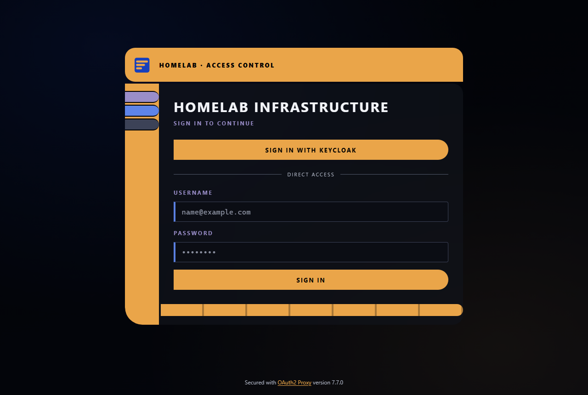
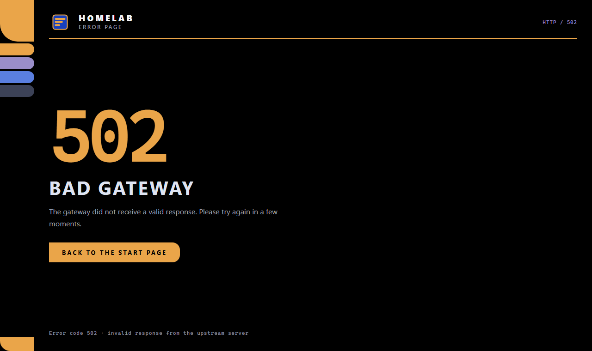
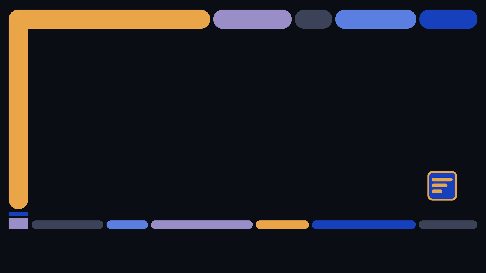
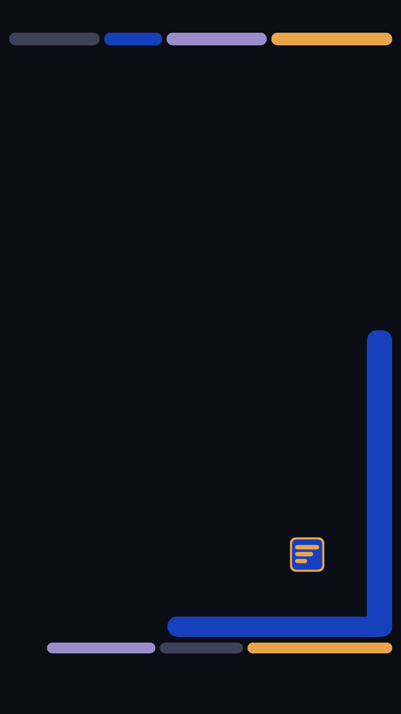
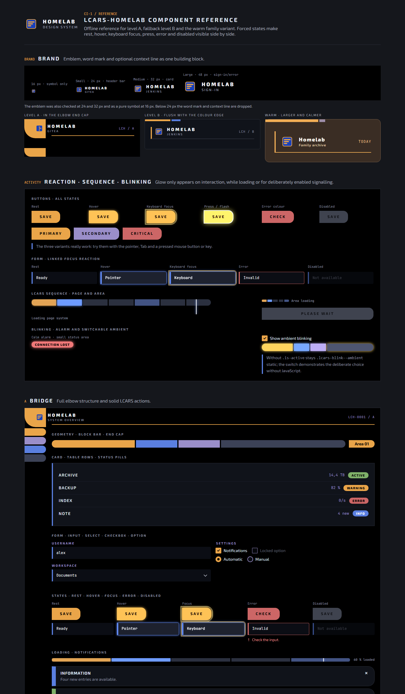

# LCARS-Homelab theme

A self-hosted, LCARS-inspired look for the web applications of a home lab: one set
of design tokens and components, plus ready-made integrations for **Keycloak,
Gitea, Jenkins, Jellyfin, Nextcloud, Guacamole, Paperless-ngx and oauth2-proxy**,
self-contained **error pages** for your reverse proxy, and matching **Windows 11**
and **Android** wallpapers.

Everything is plain CSS, HTML, SVG and a few dependency-free Node.js build scripts.
Nothing is loaded from the internet at runtime - fonts and emblems come from your
own host.

| Level | Where | Character |
|---|---|---|
| **A - bridge** | login pages, error pages | full LCARS elbow, rail and segmented bars |
| **B - console** | work areas (Gitea, Jenkins, Guacamole) | calm dark surfaces with an LCARS edge |
| **family** | Jellyfin, Nextcloud | warmer, airier variant of the same components |

Open [`reference/index.html`](reference/index.html) in a browser to see every
component in every state - it works offline, straight from the checkout.

| oauth2-proxy sign-in (level A) | Error page |
|---|---|
|  |  |

| Windows wallpaper | Android lock screen | App icons |
|---|---|---|
|  |  |   |

<details>
<summary>Component reference page</summary>



</details>

## Contents

| Path | What |
|---|---|
| `css/tokens.css` | colours, surfaces, spacing, geometry, typography, motion, the warm family tokens |
| `css/components.css` | components for `.lcars-a` and `.lcars-b`, plus `.lcars-family` |
| `css/brand.css` | single entry point (`@import` of both) |
| `assets/` | the emblem and its per-application variants, favicons with a builder |
| `fonts/` | Exo 2 and JetBrains Mono as variable WOFF2 |
| `errors/` | self-contained 404/500/502/503/504 pages for a reverse proxy |
| `integrations/<app>/` | one folder per application, each with its own README |
| `reference/index.html` | the component reference page |
| `tools/build-dist.mjs` | builds a deployable copy with your own base URL |

## Quick start

1. **Pick a base URL** where the theme files will be served, e.g.
   `https://theme.example.org/lcars-homelab/`.
2. **Build a copy for it** (Node.js 18 or newer, no packages needed):

   ```bash
   node tools/build-dist.mjs https://theme.example.org/lcars-homelab/ dist
   ```

   This copies everything that gets served into `dist/`, points all absolute
   font/emblem URLs to your base URL and rebuilds the Guacamole extension.
3. **Serve `dist/`** under exactly that URL (see [Hosting](#hosting)).
4. **Install the integrations you want** - each folder under `integrations/` has
   a README with install and uninstall steps.

The error pages, the oauth2-proxy templates, the Keycloak theme and the Gitea
theme do not depend on the base URL for their images; only fonts come from it, and
all of them fall back to system fonts if the fonts cannot be loaded.

## Hosting

Any static web server works. Three things matter:

- **CORS for fonts.** Browsers only load cross-origin fonts with an
  `Access-Control-Allow-Origin` header. Allow the hosts of your applications (or
  `*` - the files are public anyway).
- **MIME types.** `font/woff2` for `.woff2`, `image/svg+xml` for `.svg`.
- **Caching.** Use a versioned base URL (`…/lcars-homelab/v1/`) with long,
  immutable caching, and build a new copy under a new path when you update.

nginx example:

```nginx
server {
    listen 80;
    server_name theme.example.org;
    root /srv/www;                      # dist/ copied to /srv/www/lcars-homelab/

    types { font/woff2 woff2; image/svg+xml svg; text/css css; text/html html; }

    location /lcars-homelab/ {
        add_header Access-Control-Allow-Origin "*" always;
        add_header Cache-Control "public, max-age=31536000, immutable" always;
    }
}
```

Or with Docker (add the CORS header in your reverse proxy in that case):

```bash
docker run -d --name lcars-theme -p 8080:80 \
  -v "$PWD/dist:/usr/share/nginx/html/lcars-homelab:ro" nginx:alpine
```

## Integrations

| Application | Built against | What you get | Details |
|---|---|---|---|
| Keycloak | 26.7 (`keycloak.v2`) | login theme, level A | [integrations/keycloak](integrations/keycloak/README.md) |
| Gitea | 1.27 | full colour theme, logo and favicons | [integrations/gitea](integrations/gitea/README.md) |
| Jenkins | 2.568 | level B stylesheet for the Simple Theme plugin | [integrations/jenkins](integrations/jenkins/README.md) |
| Jellyfin | 10.11 web client | warm family overlay, level A login | [integrations/jellyfin](integrations/jellyfin/README.md) |
| Nextcloud | 34 | warm family overlay via Custom CSS | [integrations/nextcloud](integrations/nextcloud/README.md) |
| Guacamole | 1.6 | branding extension (JAR) | [integrations/guacamole](integrations/guacamole/README.md) |
| Paperless-ngx | 3.0 | title and logo (no custom CSS possible) | [integrations/paperless](integrations/paperless/README.md) |
| oauth2-proxy | 7.7 | sign-in and error page templates | [integrations/oauth2-proxy](integrations/oauth2-proxy/README.md) |
| Windows 11 | - | theme, wallpapers, sound scheme | [integrations/windows](integrations/windows/README.md) |
| Android | - | wallpapers and eight app icons | [integrations/android](integrations/android/README.md) |

The integrations were built against the versions listed. Class names can change
with an application update - each README ends with what to check afterwards.

## Error pages


`errors/404.html` … `errors/504.html` are completely self-contained: inline CSS,
inline emblem, no JavaScript and no external resources, so they still render when
everything else is down. Serve the folder from a small static service and point
your proxy's error handling at it - in Traefik with the `errors` middleware
(`status: ["404", "500-504"]`, `query: "/{status}.html"`), in nginx with
`error_page 502 /errors/502.html;`.

## Using the CSS in your own pages

```html
<link rel="stylesheet" href="https://theme.example.org/lcars-homelab/css/brand.css">

<main class="lcars-a">
  <!-- full LCARS bridge -->
</main>

<main class="lcars-b lcars-family">
  <!-- warm, airier version of the same components -->
</main>
```

The component classes and their states are demonstrated in
`reference/index.html`. Real interaction states work through `:hover`,
`:focus-visible`, `:active`, `:disabled` and `aria-invalid`; the `is-*` classes
only exist to show all states side by side on the reference page.

**Motion.** `.lcars-loader--large` (whole pages) and `.lcars-loader--small` (areas)
need no JavaScript. Blinking is never implicit: `.lcars-blink--alarm` pulses a
small red status area slowly, `.lcars-blink--ambient` only runs together with
`.is-active`. All rhythms stay well below 3 Hz, and `prefers-reduced-motion:
reduce` stops every animation while loaders and alarms stay recognisable through
static patterns.

**Brand mark.** `.rl-brand` combines the emblem with the word mark `Homelab` and
an optional context line:

```html
<span class="rl-brand rl-brand--medium">
  
  <span class="rl-brand__text">
    <span class="rl-brand__name">Homelab</span>
    <span class="rl-brand__context">Gitea</span>
  </span>
</span>
```

Sizes: `--symbol-16` (16 px, symbol only), `--small` (24 px, header bar),
`--medium` (32 px, card), `--large` (48 px, sign-in or error page). In a header
add `.lcars-header--brand` to the `.lcars-header`.

**Background.** Login pages read their background from `--rl-background-image`.
The default is a CSS gradient (Keycloak: the drawn `background.svg`); set the
variable to your own image if you like.

## Favicons

```bash
node assets/favicon/build-icons.mjs
```

renders the PNG sizes (16, 32, 48, 180, 192, 512 px) and `favicon.ico` from
`assets/favicon/favicon.svg` without any external library. For your own pages:

```html
<link rel="icon" href="/assets/favicon/favicon.svg" type="image/svg+xml">
<link rel="icon" href="/assets/favicon/favicon-32x32.png" sizes="32x32" type="image/png">
<link rel="apple-touch-icon" href="/assets/favicon/apple-touch-icon.png">
<link rel="manifest" href="/assets/favicon/site.webmanifest">
```

## Customising

- **Name.** The word mark says `Homelab`; search for `rl-brand__name` and for the
  titles in `errors/` and `integrations/oauth2-proxy/templates/` to change it.
- **Colours.** All colours are tokens in `css/tokens.css` (`--rl-gold`,
  `--rl-royal-blue`, `--rl-lavender`, …); the integrations translate them into
  each application's own variables.
- **Emblem.** `assets/emblem.svg` and its variants; the favicon, Gitea and
  Keycloak builders re-render the raster files from them.

## Accessibility

- visible 2 px keyboard focus with an offset;
- text and status contrasts checked for the dark surfaces (WCAG AA or better; the
  figures are noted in the stylesheets);
- labels properly linked, errors also stated in text;
- `role="status"` / `role="alert"` in the examples;
- motion switched off completely with `prefers-reduced-motion`, with static
  replacement patterns;
- no information by colour alone: status carries text, charts carry values.

## License

The code, CSS, SVG and generated images are under the [MIT license](LICENSE).
Exo 2 and JetBrains Mono are under the SIL Open Font License 1.1 - see
[`fonts/README.md`](fonts/README.md).

LCARS is a design language from Star Trek; this is an independent homage, not
affiliated with or endorsed by its rights holders. No Star Trek names, logos or
artwork are included.
