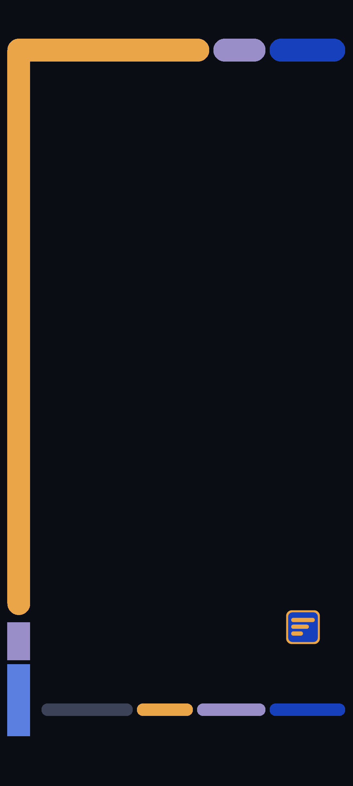
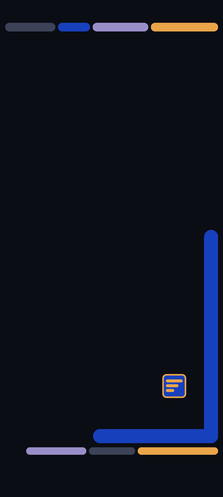
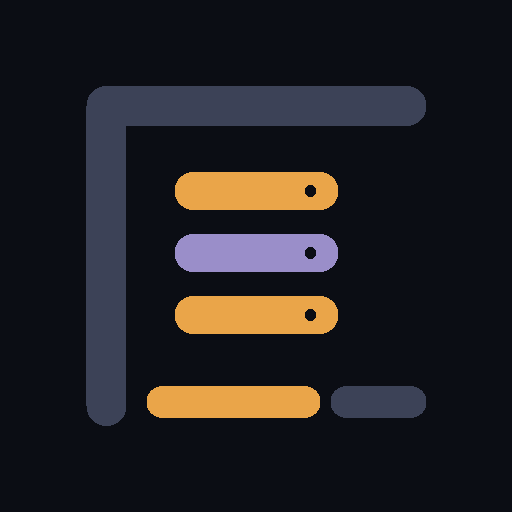
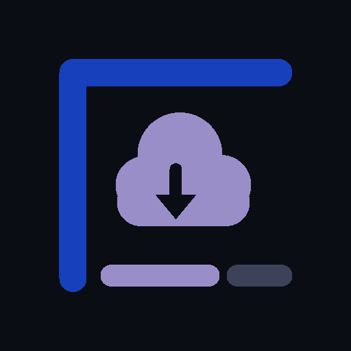
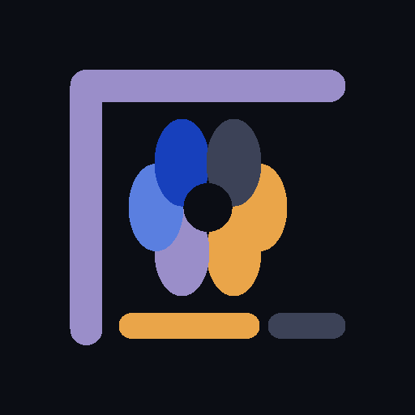
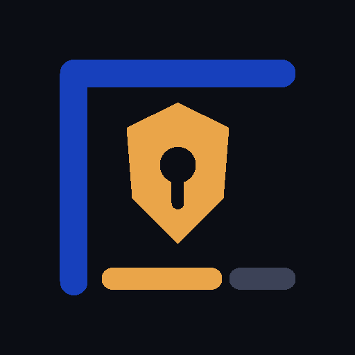

# LCARS-Homelab for Android

This is deliberately **not an installable theme and not an icon pack APK** -
Android has no theme file format that works across manufacturers. It contains
wallpapers for home and lock screen and eight app pictograms (for Gitea,
Jenkins, Nextcloud, Immich, Jellyfin, Paperless, Vaultwarden and Grafana). The pictograms are original drawings, not copies of the vendors' logos.

| Home screen | Lock screen | Icons |
|---|---|---|
|  |  |    <br>    |

## Build the files

```powershell
cd integrations\android
node .\build-wallpapers.mjs
node .\build-icons.mjs
```

Main size is 1080x2400; 1440x3200 and 1080x1920 are generated as well. The home
screen variant keeps the centre free for icons, the lock screen variant the top for
clock and notifications. The 512x512 icons keep their motif within the middle 66 %,
so common adaptive masks cut nothing important.

## Without extra apps

1. Copy the files from `wallpapers\` (and optionally `icons\`) to the phone - USB,
   Quick Share or any file access you already use.
2. In **Settings → Wallpaper & style** (named differently per manufacturer) set
   `homescreen-1080x2400.png` for the home screen. Do not zoom in; keep the left
   frame bar visible.
3. Set `lockscreen-1080x2400.png` separately for the lock screen, keeping the large
   free area at the top.
4. If the device offers a clock colour, pick gold `#eaa549` or light grey.

Assigning arbitrary PNGs as app icons is not something Android supports in
general: Pixel Launcher and Samsung One UI cannot set single gallery images per app,
and "themed icons" only use monochrome icons shipped by each app.

## Icons with a suitable launcher

Launchers such as Nova Launcher or Smart Launcher (depending on version) can assign
single icons: long-press the app icon → **Edit** → tap the icon → **Gallery/Files** →
pick the PNG from `icons\`. Launchers that only accept installed icon packs cannot use
this loose collection.

## Widget layout (optional)

For a KWGT rebuild there is no pre-made preset, but these are the values:

- clock top left, JetBrains Mono, 42 sp, weight 600, colour `#dfe4f2`;
- date/status line below, JetBrains Mono, 12 sp, capitals, colour `#8b90a0`;
- LCARS block bar: 74 dp high (52 dp on phones), 4 dp block gap, 22 dp end cap
  radius;
- blocks in gold `#eaa549`, royal blue `#1740bc`, lavender `#9a8ec9`, blue
  `#5a7fe0` and muted grey `#3c4257`;
- background `#0b0d14`, no gradients, no shadows, 2.5 dp letter spacing for short
  capital labels.

Import JetBrains Mono from `fonts\` into KWGT if needed.
