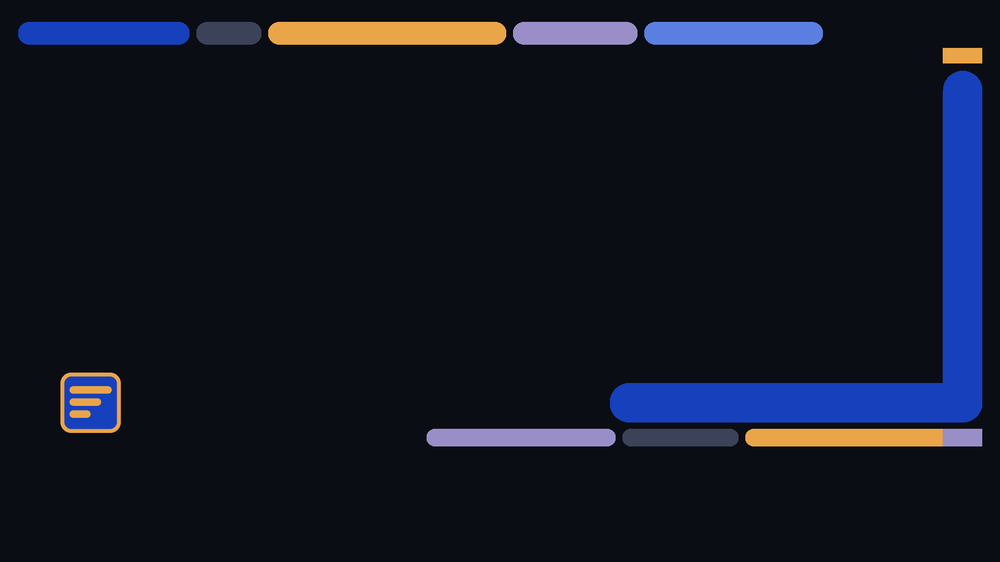

# LCARS-Homelab for Windows 11

A Windows theme installed **only in the current user profile**: no patched system
files, no background service, no administrator rights. It sets two wallpapers, dark
mode, royal blue as the accent colour, the standard Windows pointers and - where
Windows accepts it - five short system sounds of its own.

| `frame` | `signal` |
|---|---|
|  |  |

## Build the files

```powershell
cd integrations\windows
node .\build-wallpapers.mjs
node .\build-sounds.mjs
```

This writes six PNGs to `wallpapers\` (`frame` and `signal` in 1920x1080,
2560x1440 and 3840x2160) and five WAVs to `sounds\`. The theme uses the 1920x1080
pair; the others are there for other monitors. The centre stays free, and the bottom
bar ends above the usual taskbar area.

## Install and update

```powershell
.\install.ps1
```

If the execution policy blocks scripts, run just this one process without changing
the policy:

```powershell
powershell.exe -NoProfile -ExecutionPolicy Bypass -File .\install.ps1
```

The script

1. checks that all six wallpapers and five sounds exist;
2. copies them to `%LocalAppData%\Microsoft\Windows\Themes\LCARS-Homelab\`;
3. replaces `__TARGET_DIR__` in the template with that absolute path;
4. writes the finished `LCARS-Homelab.theme` there as UTF-16 LE;
5. opens it through the Windows file association.

Running it again overwrites the same files and updates the same installation.

The `LCARS-Homelab.theme` next to the script is **only a template** - its
placeholder is not a valid path, so do not double-click it.

Optionally turn on **Settings → Personalization → Colors → Show accent color on
Start and taskbar / on title bars and window borders**; the theme does not force
these.

## Colours

Royal blue (`#1740bc`) is the system accent on purpose - on large title bars and
selections it is calmer than gold, which stays the brand accent in the wallpapers.
The theme uses `AutoColorization=0`, a fixed `ColorizationColor=0XC41740BC`
(AARRGGBB: alpha `C4`, RGB `17 40 BC`) and `SystemMode=Dark`/`AppMode=Dark`, the same
combination as Microsoft's own `dark.theme`.

## Sounds

The WAV files are self-generated sine tones: mono, 16-bit PCM, 44.1 kHz, 100 to
200 ms, 6 to 12 % peak level. Whether Windows registers the scheme name
`LCARS-Homelab` and the per-event assignments from a theme file is not guaranteed
on every Windows 11 version, and the installer does not write the registry. If you
hear no Homelab sounds:

1. Open **Settings → System → Sound → More sound settings → Sounds**.
2. Assign the files from `%LocalAppData%\Microsoft\Windows\Themes\LCARS-Homelab\sounds\`
   to **Default Beep**, **Critical Stop**, **Notification**, **Device Connect** and
   **Device Disconnect**.
3. **Save As…** `LCARS-Homelab`.

## Uninstall

```powershell
.\uninstall.ps1
```

(or with `-ExecutionPolicy Bypass` as above). The script asks Windows to open the
built-in `aero.theme`, waits a moment and then removes only
`%LocalAppData%\Microsoft\Windows\Themes\LCARS-Homelab\`. If a policy or a slow
settings dialog keeps the theme, pick a Windows theme under **Personalization →
Themes** by hand.

Not removed automatically: a sound scheme you saved by hand, cached theme
previews, the accent colour switches, settings Windows synced to other devices.

## Pointers

No custom pointer scheme is included: pointers have to be precise at every size and
scaling, and a decorative but worse pointer is no gain. The template uses exactly
the standard Windows pointer paths.
